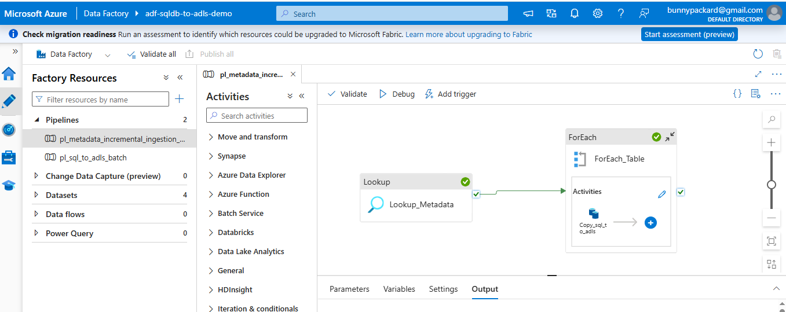
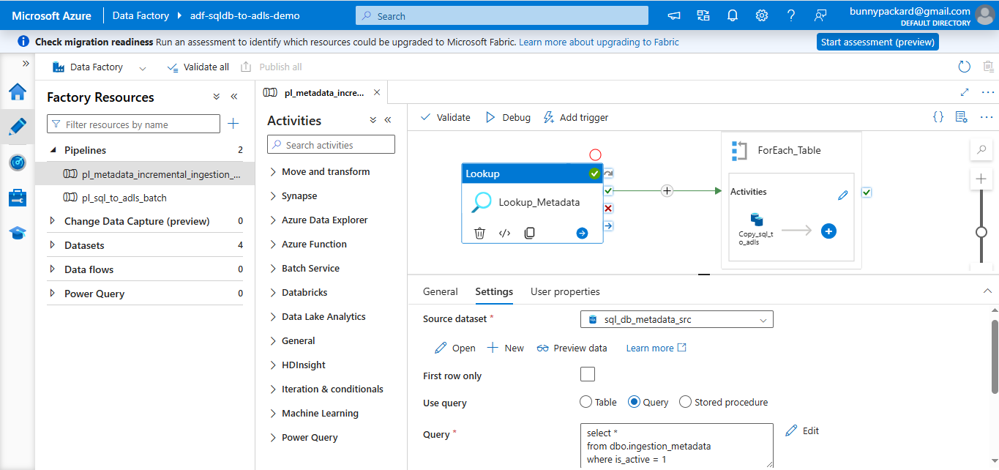
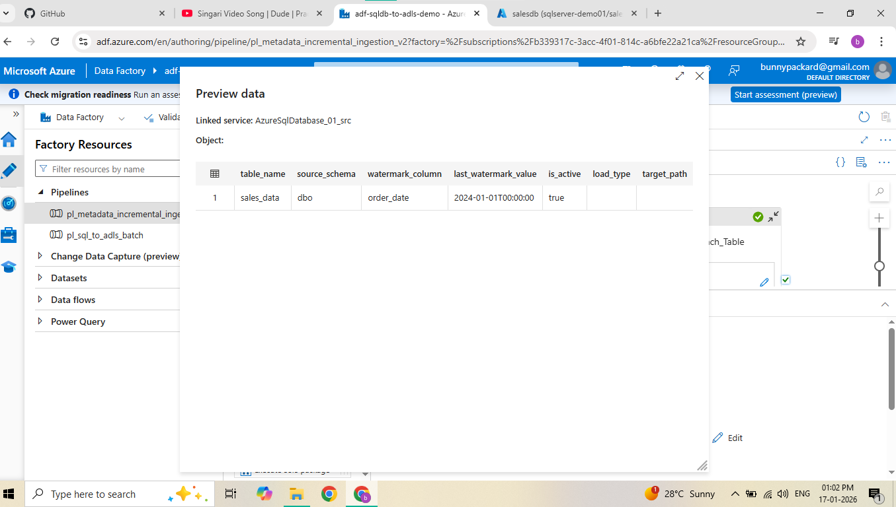
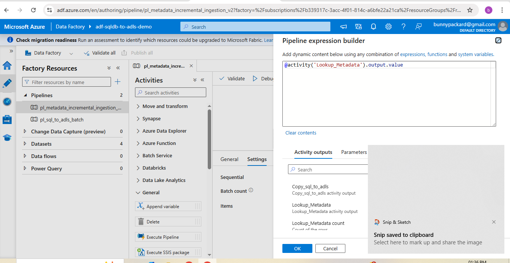
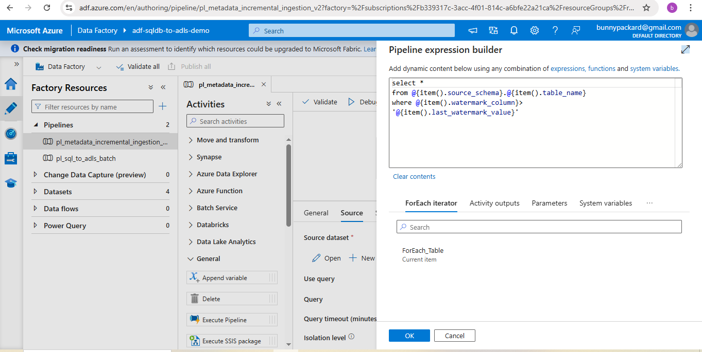
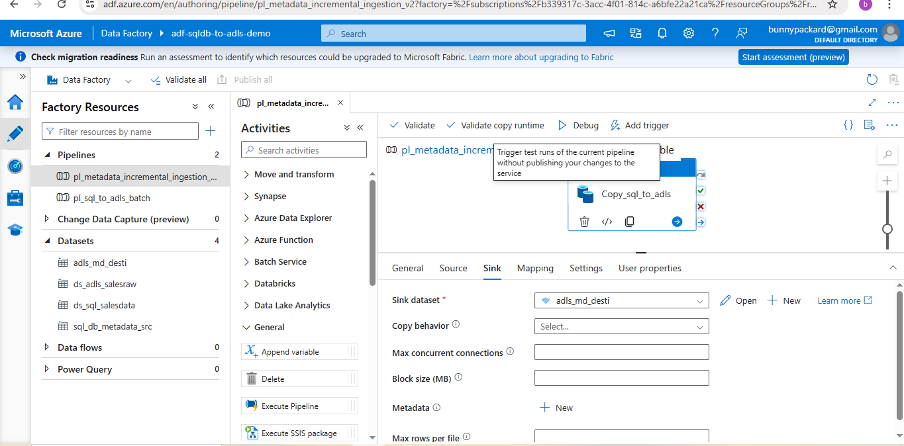
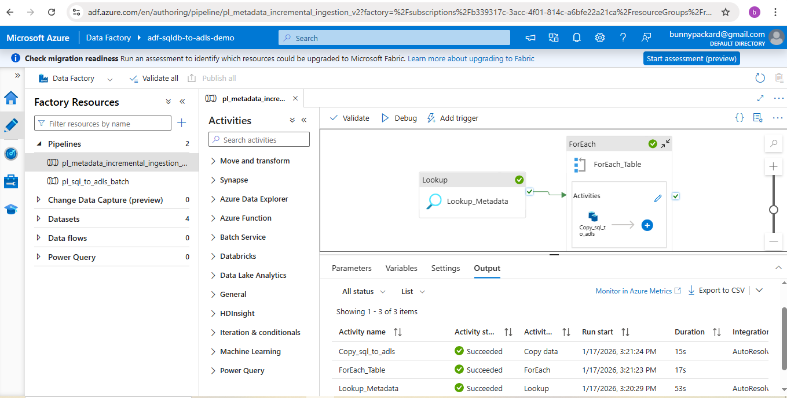

# Project 02: Metadata Driven Incremental Ingestion (Azure Data Factory)

## Objective
Design a metadata-driven Azure Data Factory pipeline to ingest multiple
SQL tables into ADLS Gen2 using incremental loading logic.

---

## Problem Statement
Creating individual pipelines for each table is not scalable.
This project solves that by using a metadata table to control ingestion.

---

## Solution Overview
- Single ADF pipeline
- Metadata table drives source configuration
- Incremental load using watermark column
- Dynamic datasets and queries

---

## Architecture
Source: Azure SQL Database  
Orchestration: Azure Data Factory  
Storage: ADLS Gen2 (Parquet)

---

## Pipeline Flow
1. Lookup activity reads active tables from metadata
2. ForEach iterates through each table
3. Copy activity loads incremental data
4. Stored procedure updates watermark

---

## Metadata Table
| Column | Description |
|------|------------|
| table_name | Source table |
| watermark_column | Incremental column |
| last_watermark_value | Last loaded value |
| is_active | Enable/disable ingestion |

---

## Incremental Logic
Only records greater than the last watermark value are ingested during each pipeline run.

---

## Technologies Used
- Azure Data Factory
- Azure SQL Database
- ADLS Gen2
- SQL (Stored Procedures)
- Parquet

---

## Outcome
- Scalable ingestion
- Easy onboarding of new tables
- Production-ready design

---
## Pipeline Screenshots

### 1. Pipeline Overview

### 2. Metadata Lookup Configuration

### 3. Lookup Output (Metadata Table)

### 4. ForEach Items Expression

### 5. Copy Activity – Dynamic Query

### 6. Copy Activity – Sink (Metadata Driven Path)

### 7. Pipeline Run – Success

## Author
Keerthivardhan  
Aspiring Data Engineer | Azure | SQL | ADF
